# BeeKeeper Registry — Mobile App

A cross-platform mobile application built with **.NET MAUI**, developed during my On-the-Job Training (OJT) at the **Bureau of Animal Industry (BAI)**, Department of Agriculture, Philippines. The app digitizes the beekeeper registration process for the agency — replacing manual, paper-based farm and beekeeper profiling with a structured, mobile-first registration system.

> 📱 This repository contains the **mobile client** (.NET MAUI). The backend (ASP.NET Core Web API) is maintained in a private repository, as the system is part of an active government registration platform.

---

## 📸 Screenshots

### Authentication & Onboarding

| Login | Account Setup | Personal Info |
|---|---|---|
| 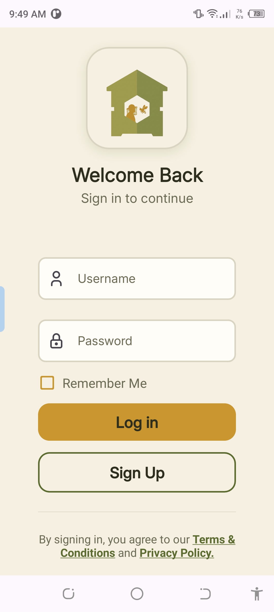 | 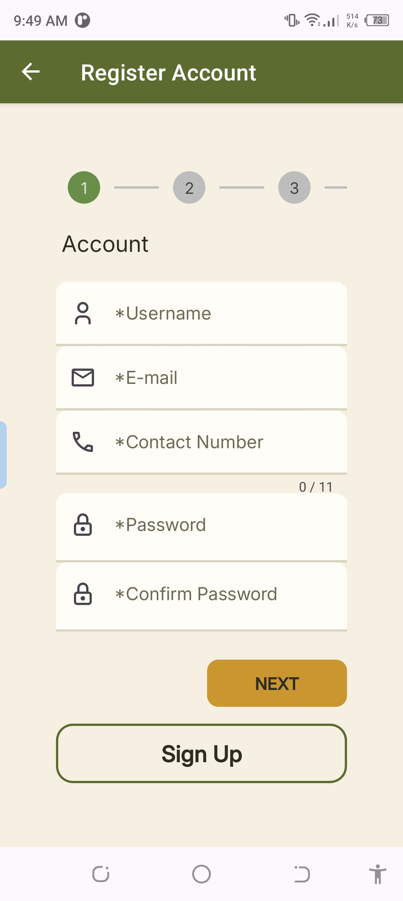 | 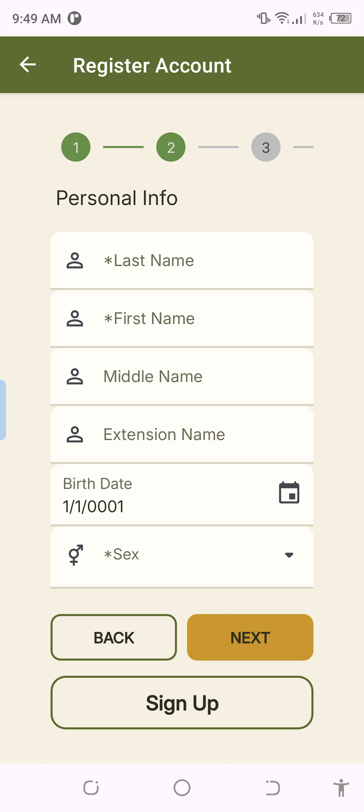 |

The registration flow is a guided multi-step wizard with inline validation (e.g. real-time email format checking) rather than a single long form — reducing input errors and cognitive load for end users who are often first-time mobile app users.

### Beekeeper Dashboard

| Home Dashboard | Trainings | My Farms | Profile |
|---|---|---|---|
| 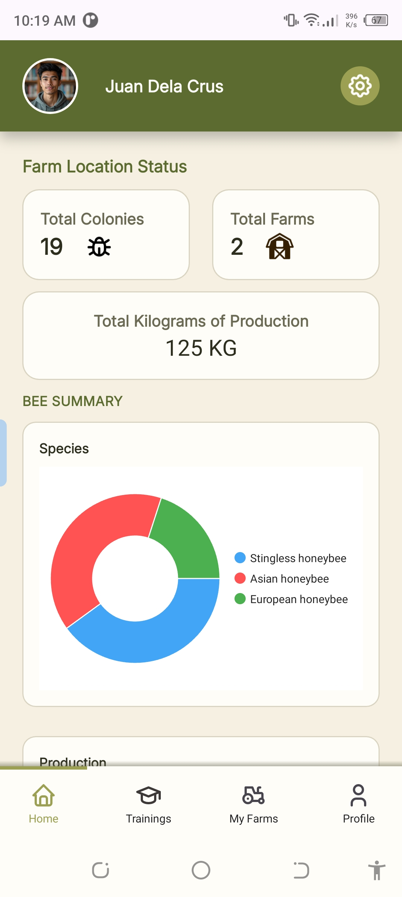 | 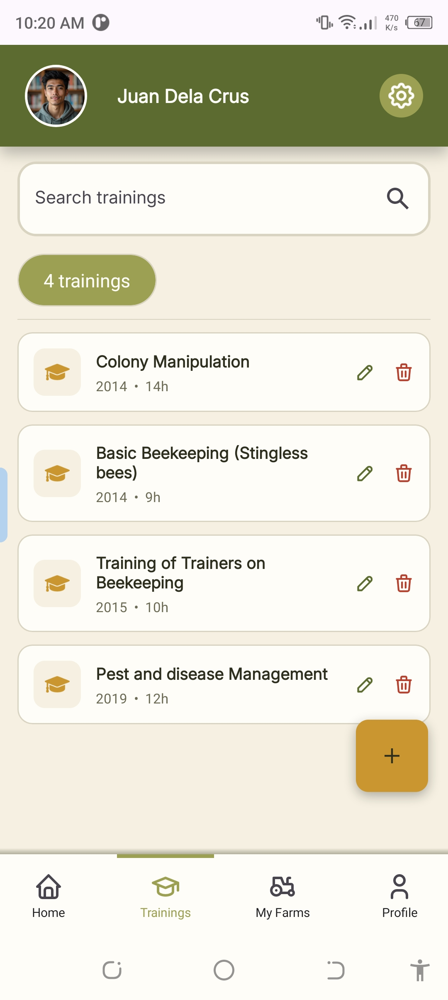 | 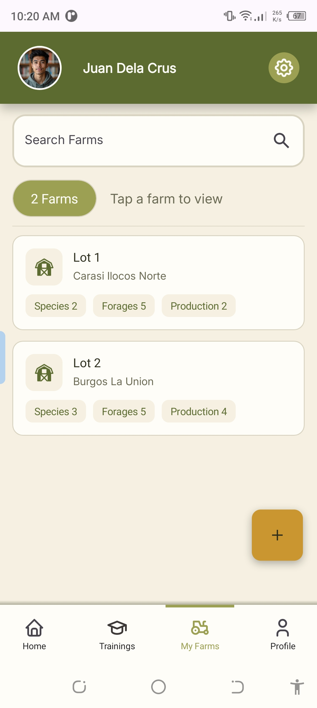 | 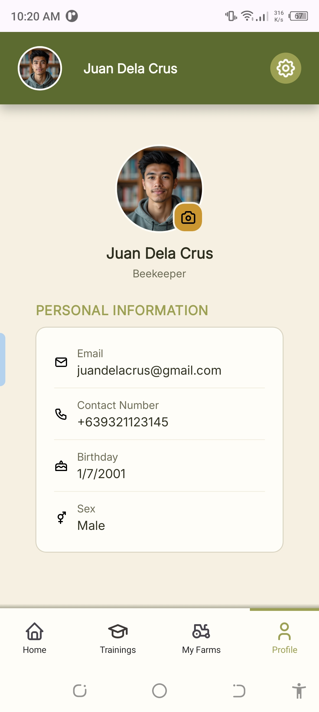 |

The home dashboard aggregates farm and colony data into at-a-glance stats (total colonies, total farms, total production in kg) plus a species breakdown chart — giving beekeepers a quick health check of their operations.

### Farm Profile Management

| Farm Profile View | Bee Species | Bee Production | Biosecurity Measures |
|---|---|---|---|
| 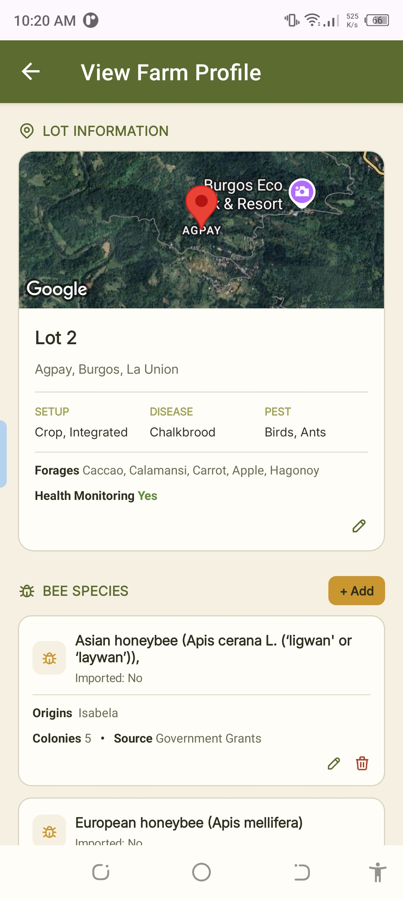 | 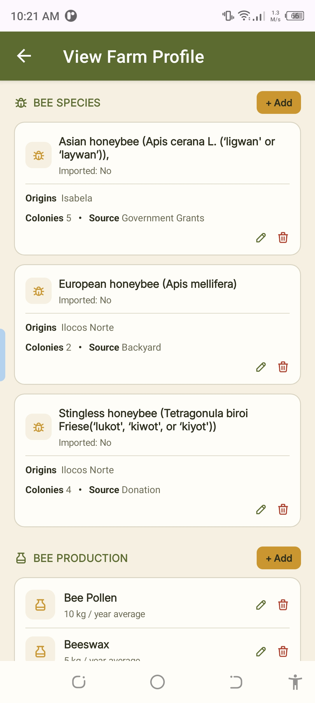 | 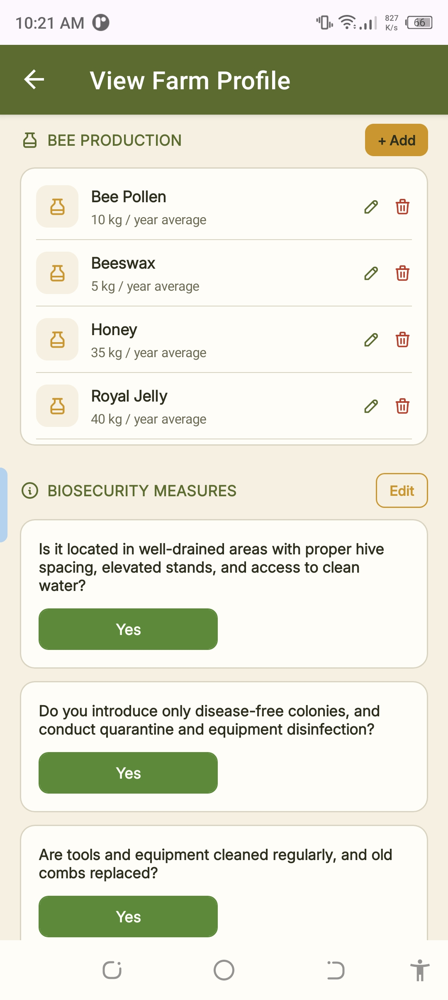 | 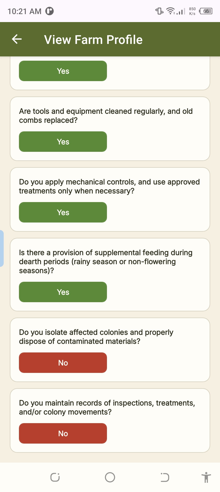 |

Each registered farm holds detailed records of species kept, production output (honey, beeswax, bee pollen, royal jelly), and a biosecurity compliance checklist — fields requested by BAI to support disease surveillance and production reporting at the agency level.

---

## 🛠 Tech Stack

**Mobile / Frontend**
- .NET MAUI — built and tested on Android (iOS not yet tested on this build, though supported by the framework)
- MVVM architecture using the **MVVM Toolkit** (`[ObservableProperty]`, `[RelayCommand]`)
- **DevExpress** UI controls (`DXBorder`, `DXImage`, `DXCollectionView`, `TokenEdit`)
- Custom reusable popup/dialog components (loading states, confirmations, error/success dialogs, Google Maps picker)
- Google Maps integration for geotagging farm locations down to region/province/municipality/barangay

**Backend (consumed by this app, private repo)**
- ASP.NET Core Web API
- Entity Framework Core
- ASP.NET Core Identity
- JWT Authentication with refresh tokens (auto-refresh on 401, thread-safe via `SemaphoreSlim`)
- Microsoft SQL Server

**Architecture**
- Simplified clean architecture on the backend: `Database → Repository → Service → Controller`
- Client-side `DelegatingHandler` (`JwtAuthHandler`) intercepts every request, attaches the bearer token, and transparently retries on token expiry

---

## ✨ Features

- **Multi-step Beekeeper Registration** — account creation, personal info, geographic location (region → province → municipality → barangay), and beekeeping profile, with per-step validation
- **Farm Management** — register and manage multiple farm profiles ("Lots") per beekeeper, each with map-pinned location
- **Bee Species Tracking** — record species (Asian honeybee, European honeybee, Stingless honeybee, etc.), origin, colony count, and source (government grants, backyard, donation)
- **Production Records** — track honey, beeswax, bee pollen, and royal jelly output per farm, in kg/year
- **Biosecurity Compliance Checklist** — Yes/No questionnaire covering hive siting, disease-free colony introduction, equipment sanitation, and record-keeping practices
- **Training Records** — view and manage beekeeping trainings attended, with duration and year
- **Profile Management** — update personal profile and profile photo, with upload validation
- **Authentication** — secure login/registration backed by JWT with refresh token support

---

## 🔐 Note on Backend Access

This app communicates with a private ASP.NET Core Web API. The API repository is not public because the system is built for and partially deployed within a Philippine government agency (BAI). The backend handles:

- JWT issuance & refresh token rotation
- Beekeeper/farm/species/production CRUD operations
- Role-based access control

Architecture, code structure, and implementation details (JWT flow, repository pattern, EF Core setup) can be walked through on request.

---

## 👤 Author

**Victor Yuri S. Ortega** — BSIT Graduate, 2026
GitHub: [@Yuri-Ortega](https://github.com/Yuri-Ortega)
